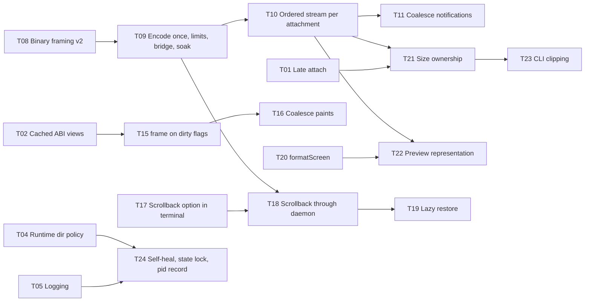

# Continue: session library fixes

A handoff. The four session packages (`@werk/terminal`, `@werk/session`,
`@werk/session-daemon`, `@werk/terminal-beamterm`) were reviewed on
2026-09-05 against one question: is anything stopping an early werk being
built on them? The boundaries, API shape and lifecycle contracts are right.
Six problems would have surfaced in the first week of real use, four of them
interlocking inside the terminal stream. Six research notes, one per problem
cluster, worked out fixes with prototypes and measurements. This doc compiles
them into one plan and a task list. §6 carries the state of each task; the
packages now behave as described here, and `docs/session-library.md` is the
reference for what they do rather than for why.

> **Working material, not product doctrine.** Everything here is a lean unless
> it says otherwise, and §7 records where each decision landed and which two
> are still open.
> The notes and prototypes in [`session-library-fixes/`](session-library-fixes/)
> were measured on one WSL2 machine on Bun 1.3.14; some numbers were
> transcribed after a reboot wiped the scratch space and are labelled as such in
> the notes. Prototypes are reference material like `packages/werk-poc`; product
> packages do not import them.

---

## 1. What the review found

Build, typecheck and the 33 unit tests of the reviewed packages passed. The
problems were in what happens under a realistic workload rather than in what
the tests covered.

| #   | Problem                                                                      | Measured                                                                                                        | Note                                                   |
| --- | ---------------------------------------------------------------------------- | --------------------------------------------------------------------------------------------------------------- | ------------------------------------------------------ |
| 1   | Bytes cross the wire as JSON arrays of numbers                               | 3.58x inflation; a 2 MB snapshot is a 7.5 MB frame, 640 ms to encode, 1,057 ms to decode; 4 MB cannot be sent   | [01](session-library-fixes/01-wire-framing.md)         |
| 2   | Every control event (effect, resize, exit, size-holder) forces a full resync | 200 prompt lines with a title and cwd each: 402 resyncs, 3.6 MB on the wire, for 5 KB of output                 | [02](session-library-fixes/02-stream-scheduler.md)     |
| 3   | Scrollback is effectively a few hundred rows                                 | 30,000 lines written at 120 cols, 685 retained; the engine default is 10,000 bytes                              | [03](session-library-fixes/03-scrollback.md)           |
| 4   | Replica `frame()` walks every cell through the WASM boundary, on every event | 9 / 24 / 50 ms per frame at 80x24 / 120x40 / 200x50 whatever changed; a 50-chunk burst is 1.04 s of main thread | [04](session-library-fixes/04-replica-performance.md)  |
| 5   | Size ownership, previews and late attach do not fit a fleet view             | First attacher holds the size; `preview` refused; attaching after exit yields a snapshot and then silence       | [06](session-library-fixes/06-attachment-semantics.md) |
| 6   | Operability gaps                                                             | Runtime dir vanishes on logout and a second daemon orphans the first; no logging; sessions inherit a stale env  | [05](session-library-fixes/05-daemon-operability.md)   |

Also confirmed and left as known: killing the daemon kills every session's
process (the record recovers as `lost`); there is no process-preserving daemon
upgrade. That is the proposal's stated open requirement, not a defect in these
packages.

## 2. The shape of the fix

Problems 1 to 4 are one problem seen from four sides. The JSON byte encoding
makes every snapshot three and a half times its weight and slow to produce; the
scheduler sends a snapshot before every control event, so busy sessions send
them constantly; the tiny scrollback keeps snapshots small enough to hide both;
and the replica pays a full-grid walk for every event it receives, so each
snapshot also costs the client. Raising scrollback on its own would break the
8 MiB frame cap. The fixes therefore land in a fixed order:

1. **Binary framing**, encoded once in the daemon and queued as bytes. Wire
   returns to 1.0x and encode drops from hundreds of milliseconds to under one.
2. **One ordered stream per attachment**, with a resync only after output was
   actually dropped or after a resize. The prototype takes the 200-prompt case
   from 402 resyncs to none.
3. **Scrollback made configurable** with a 10 MB default and a daemon cap, now
   that a multi-MB snapshot is cheap to carry, plus dirty-driven checkpoints and
   lazy restore so retained records stop costing anything while idle.
4. **`frame()` rebuilt on the render state's dirty flags and bulk row reads**,
   and paints coalesced to one per tick. A 120x40 frame goes from 24 ms to
   0.34 ms on a full-screen change and 0.013 ms on a one-byte change.

Attachment semantics (5) builds on the new scheduler because size-holder,
late-attach and preview events stop costing a snapshot there. Operability (6)
is independent and can proceed in parallel.

## 3. Cluster by cluster

### 3.1 Wire framing

**Recommendation (lean, strongly).** A binary frame with no new dependency:

```
u32 BE  bodyLength      everything after this field; the cap applies here
u32 BE  jsonLength
bytes   JSON header     UTF-8; every Uint8Array in the message becomes {"$b": i}
repeat  u32 BE blobLength, blob bytes   i = 0, 1, 2 ... in placeholder order
```

Control messages stay readable JSON. Decoded blobs are views into the frame
(no copy). The decoder allocates the body once at its final size instead of
concatenating per chunk. `PROTOCOL_VERSION` becomes 2; the protocol is private
and both ends ship together. `FramedTransport` gains `sendFrame(bytes)` so the
daemon encodes each message once and queues the bytes.

| Workload                    | Today (wire, encode, decode) | Proposed                  |
| --------------------------- | ---------------------------- | ------------------------- |
| 1.5 MB output, 32 KB chunks | 5.6 MB, 170 ms, 360 ms       | 1.58 MB, 0.8 ms, 0.1 ms   |
| 2 MB snapshot               | 7.5 MB, 640 ms, 1,057 ms     | 2.1 MB, 0.6 ms, under 0.1 |
| 8 MiB frame in 4 KiB chunks | 3,580 ms buffering           | 4.6 ms                    |

Base64 (1.34x) and MessagePack or CBOR (1.0x, a dependency) were measured and
are weaker. The frame cap stays as a receive-side allocation bound; it probably
wants to be raw-byte, larger (32 MiB towards the client is a plausible number,
to be chosen with the scrollback work), directional (1 MiB towards the daemon,
with pastes chunked) and advertised in `hello`. The 16 MiB family of limits in
the transport, daemon, bridge and browser adapter must move together, and the
bridge's `maxPayloadLength` should derive from the protocol constant.

Effort 10 to 14 hours. Files: `packages/session/src/protocol.ts`,
`packages/session/src/index.ts`, `packages/session-daemon/src/index.ts`
(`queue`, `flush`, `emit`, `attach`), `examples/session-web/src/{bridge,websocket}.ts`,
`scripts/session-soak.ts` (fragment the first 8 bytes byte-wise), the soak
baseline, `packages/session/README.md`.

### 3.2 Stream scheduler, notifications, checkpoints, limits

**Scheduler.** One ordered stream per attachment holding pre-encoded frames.
Only output is droppable. When a connection's output budget is exceeded, the
stream with the largest backlog loses its whole output backlog and gets a
resync placeholder that reserves its stream position immediately but is
snapshotted and encoded only when it reaches the head. Control events never
cost a snapshot; `ended` is always delivered; streams are served round-robin
after the control queue. One correction to the review: the resync after a
resize is genuinely needed (a replica's own reflow can disagree with the
engine), so resize still invalidates. No client or replica change is needed.

**Notifications.** `activity` and `effect` coalesce per session: leading edge,
then at most one `activity` and one `effect` per kind per 250 ms, drained before
any state change so nothing trails `exited`. `publicInfo` is computed once per
event, not once per watcher. The full record stays on every event because the
fleet test and the README rely on it.

**Checkpoints.** A record is checkpointed only after output, resize, effect or
state change, once on exit, and at shutdown if still dirty. Lost and restored
records are never rewritten. The `checkpoint` watch event stops being a
heartbeat.

**Limits.** `limits.sessions` counts live processes plus pending creates. A
separate `retainedSessions` cap (prototype default 512) bounds exited, failed
and lost records with oldest-first eviction through the same path as `remove`.
The eviction policy is D1 in §7.

| Case                                    | Before                         | Prototype                 |
| --------------------------------------- | ------------------------------ | ------------------------- |
| 200 prompt lines, viewer                | 402 resyncs, 3.59 MB, 3,409 ms | 0 resyncs, 114 KB, 317 ms |
| 200 prompt lines, watcher               | 408 frames, 481 KB             | 11 frames, 11 KB          |
| 3 exited sessions idle, 11 s            | 7 checkpoint events            | 0                         |
| 4th create with 3 exited, `sessions: 3` | `LIMIT`                        | created                   |

Open: a persistently slow viewer resyncs on every send, and with scrollback
each resync is hundreds of KB, so a minimum spacing between resyncs per stream
(or a budget scaled to snapshot size) is probably wanted. `controlQueueMessages`
1024 is too low for a stalled watcher over 128 sessions; 8192 or dropping the
message count in favour of the byte limit looks right. The full daemon test
suites did not run against the prototype after the reboot; the new tests in the
plan are where that evidence comes from.

Effort 15 to 21 hours, best after framing. Files: `packages/session-daemon/src/index.ts`
(types at 63-91, `queue`/`flush`/`emit`/`end` at 176-359, PTY callback at
584-624, checkpoint at 375-432, limits at 433-483 and 515-518), both READMEs,
`docs/session-library.md`, the soak baseline.

### 3.3 Scrollback and snapshot sizing

**What is true.** The pinned engine defaults `max_scrollback_bytes` to 10,000,
but the effective limit is `max(explicit, two pages)` and a page in this build
is 458,752 bytes of page memory (about 8 bytes per cell, so 451 rows at 120
cols, 674 at 80). Retained pages are `floor(limit / 458,752)` with a floor of
two, which is why 10 KB, 100 KB, 500 KB and 1 MB all retain about 650 to 690
rows and why the review's 1 MB setting looked like a no-op. The option can be
set at any time; lowering prunes at once. The snapshot carries every retained
page and both limits in its header, so a restored terminal keeps its limit and
the envelope needs no new field.

| Setting | Pages | Rows at 120 cols | Snapshot | Encode | Restore | WASM live |
| ------- | ----- | ---------------- | -------- | ------ | ------- | --------- |
| default | 2     | 686              | 50 KB    | 3.8 ms | 5.3 ms  | 2.3 MB    |
| 2 MB    | 4     | 1,588            | 114 KB   | 0.9 ms | 6.2 ms  | 3.4 MB    |
| 5 MB    | 10    | 4,294            | 307 KB   | 1.1 ms | 7.2 ms  | 6.5 MB    |
| 10 MB   | 21    | 9,255            | 661 KB   | 3.0 ms | 8.9 ms  | 12.3 MB   |

Styled worst case at 10 MB (every cell filled, style change every four cells):
4.4 MB snapshot, 19 ms restore. Per-session memory is only consumed when the
scrollback fills; an idle shell sits at about 2.3 MB.

**Recommendation (lean).** Default and daemon cap of 10,000,000 bytes,
matching Ghostty desktop. `create(size, { scrollbackBytes })` and
`restore(envelope, options)` in `@werk/terminal`, a `scrollback()` reader on
the handle, `CreateSessionOptions.scrollbackBytes` in `@werk/session`, a
`LIMIT` error above the daemon cap, the value on `SessionInfo` and the cap in
`DaemonInfo.capabilities`. Whether `@werk/terminal`'s own default moves from
upstream's 10,000 is open; the lean is to leave it and let the daemon always
pass a value.

**Two daemon changes matter more than the number.** Every retained record is
restored into a live WASM terminal at startup: 128 records at the 10 MB cap
measured 8.2 s and 1.4 GB RSS. Restore lazily (validate the header cheaply,
send `record.checkpoint` bytes on attach, decode on `readScreen`/`readHistory`,
dispose after idle). And checkpoint only dirty records (§3.2). A JSC property
shapes the budget: Bun gives the first eight WASM memories a fast 4 GiB
reservation and later ones copy the whole buffer on every grow, so growth-heavy
work runs about 6x slower from the ninth instance at this size. A 10 MB cap
keeps steady-state writes unaffected. The per-session cap does not bound the
daemon (128 full sessions is about 1.4 GB, and page compression is unsupported
on wasm32); a process-wide budget is an open question.

Bonus: `CURSOR_AT_PROMPT` (OSC 133) works and survives restore, but it means
"the shell is idle at a prompt", not "needs you"; `progress` (OSC 9;4) is
already an effect and could become a `SessionInfo` field. Which agents emit
either is not established.

Effort 16 to 18 hours. Files: `packages/terminal/src/{types,engine}.ts`,
`packages/session/src/types.ts`, `packages/session-daemon/src/index.ts`
(create at 516-560, restore at 432-480, attach guard at 757), `packages/werk/src/main.ts`
(`--scrollback`), READMEs, `docs/session-library.md`.

### 3.4 Replica paint performance

**Profile.** At 120x40 a frame makes 43,125 WASM calls and allocates 196,719
typed-array views; only 15 to 18 percent of the time is inside WASM, the rest is
marshalling in `abi.ts`, plus about 1 ms of `JSON.stringify` diffing. Caching
the two views alone gives 25 percent.

**The ABI already has what is needed.** A persistent render state with global
and per-row dirty flags (`GhosttyRenderStateData.DIRTY`, `row_iterator_next_dirty`),
`CELLS_RAW` (one call per row returning a view over packed `GhosttyCell` u64s,
with the bit layout in `ghostty_type_json`), and a once-per-frame `COLORS`
struct replacing the per-cell colour calls. `update` consumes the terminal's
dirty state, so there must be exactly one render state per terminal, and the
caller must `clean` after a complete frame.

**Prototype.** Keeps one render state, row iterator, cells handle and scratch
buffer per terminal; walks nothing on a clean frame, dirty rows on a partial
one, all rows on a full one; reads `STYLE` only for cells with a non-zero style
id; compares each decoded row field by field against a shadow; reports only
rows that differ. Identical screens and cursors to today's engine across 25
scripts and 170 checkpoints. One upstream gap: appending a combining mark or
ZWJ to a cell marks nothing dirty on the pinned build; the prototype re-reads
the cursor row from a throwaway render state whenever a write produced no dirty
rows (0.02 to 0.05 ms).

| Case (120x40)    | Today   | Prototype |
| ---------------- | ------- | --------- |
| one byte changed | 24.4 ms | 0.013 ms  |
| whole screen     | 22.9 ms | 0.34 ms   |
| cursor move only | 23.2 ms | 0.016 ms  |
| idle             | 23.5 ms | 0.001 ms  |

**Coalescing.** `TerminalReplica` keeps applying events immediately and
`apply()` still resolves per event, but paints are requested and at most one
runs per scheduler tick (`requestAnimationFrame` where it exists, else
`setTimeout(0)`, injectable). `queueMicrotask` is the wrong default because
each `accept` is already its own microtask. A 50-chunk burst goes from 50 paints
and 1,951 rows (1.04 s today) to 1 paint and 40 rows (0.2 ms with the
prototype). The DOM renderer and CLI renderer need no change; beamterm could
emit only changed rows if its batch keeps cells it is not given (untested).

Effort 6.5 to 8.5 hours for the core. Files: `packages/terminal/src/abi.ts`,
`engine.ts` (`frame()` 398-416, `cells()` 417-509 deleted), `replica.ts`,
`packages/terminal/README.md`, tests. The grapheme dirty gap is worth reporting
upstream with the 12x8 reproduction.

### 3.5 Attachment semantics

**Size ownership (lean).** Keep one transferable holder visible in listings,
but allow the size to be free. `attach` takes
`holdSize: "never" | "if-free" | "claim"`, defaulting to `if-free` when input
is granted and `never` otherwise; `preview` is forced to `never`. `claim` takes
the size from the holder subject to `authorize(principal, "claimSize", session)`
and degrades to attaching without it rather than failing. A new `claimSize`
request does the same after attach. Succession when a holder leaves prefers
input-capable attachments, then those that asked to claim, then the most
recent; otherwise the size is free. `resize` on a record with no live process
returns `CONFLICT`. `AttachmentInfo` gains `representation` and `holdSize` so
listings can tell tiles from terminals.

**Preview (lean).** Text frames, not snapshots. The engine's formatter emits
the active screen as VT (colour kept) in 0.1 ms and 5.8 KB at 120x40. The
daemon formats once per record per interval (on change, 250 ms minimum, 500 ms
default) and sends the same encoding to every preview viewer; preview viewers
get no output stream, no resyncs, no size, and receive `preview`, `exit` and
`ended` only. Twenty busy 120x40 tiles cost the daemon about 6 ms of CPU per
second and 232 KB/s on the wire, against 50 ms to 1.6 s per second and 2 to
30 MB/s for snapshot-driven tiles. Needs `formatScreen(format)` and a
`preview` capability in `@werk/terminal`. With the new scheduler the preview
becomes a "latest frame" slot on the attachment's stream.

**Late attach.** When the record has no live process, `attach`'s `after()`
queues the snapshot, then `exit` when known, then `ended: "session-ended"`,
and never registers a viewer. The client contract already allows `ended`
straight after a snapshot. `lost` records get `ended` without a synthetic exit.

**Non-holding terminals.** The CLI clips to the local window, clears on grid
change, shows a one-line status row while the grids differ, and offers
`--claim-size` (default for a writable attach) and `--follow`. No renderer seam
change.

Effort 34 to 48 hours, in the order late attach, size ownership, preview, CLI
clipping. Files: `packages/session-daemon/src/index.ts` (attach 754-802, end
332-359, resize/transfer 649-696), `packages/session/src/{types,index}.ts`,
`packages/terminal/src/{types,engine}.ts`, `packages/werk/src/main.ts`,
`examples/session-web/src/client.ts`, READMEs, proposal 02's size paragraph.

### 3.6 Daemon operability

**A. Runtime directory.** Reproduced: remove the runtime dir under a live
daemon and the next `werk list` spawns a second daemon on a fresh lock file,
lists the live session as `lost`, and the two daemons alternately rewrite the
same checkpoint. logind removes `/run/user/UID` about ten seconds after the
last logout unless lingering is on; macOS removes `$TMPDIR` files unaccessed
for three days; Fedora and Arch age `/tmp` at ten days but tmpfiles skips a
directory held under a shared `flock`. Recommendation: default to `/tmp/werk-UID`
on POSIX (tmux's choice) and `%LOCALAPPDATA%\werk\run` on Windows, honour
`WERK_RUNTIME_DIR`; verify ownership and mode on the client too; move the lock
to the state dir so the guarantee becomes one daemon per state dir; write
`$stateDir/daemon.json` with pid and a `bootId`; have the daemon check its
socket inode every 5 s and on `SIGUSR1`, recreating socket, endpoint and lock
when they vanish; have `ensureSessionDaemon` refuse to spawn beside a live
recorded daemon; hold a shared `flock` on the directory and touch the files
hourly. This departs from research doc 04 §5's XDG-first hierarchy, and that
doc should be rewritten to match if adopted. About 15 hours.

**B. The lock on musl.** The review's premise was wrong: musl's loader
resolves any `libc.*` name to itself, so `dlopen("libc.so.6")` succeeds on
Alpine and `flock` is exclusive there (verified in `oven/bun:1.3.14-alpine`;
the compiled-binary variant is unverified). Keep `flock`; restore the PoC's
candidate list, add a Linux abstract-socket fallback, log which mechanism
holds, and add an Alpine lane to CI. About 4 hours.

**C. Logging.** Nothing is logged; a daemon that failed on an over-long socket
path produced only "did not become ready". A dependency-free line logger to
`$stateDir/daemon.log` with size rotation, `--log-level` and
`WERK_LOG_LEVEL`, a fixed event vocabulary (never env, input bytes,
credentials or full argv above debug), log-and-continue for
`unhandledRejection`, log-checkpoint-continue for `uncaughtException` with an
escalation counter, and `werk info` plus `werk doctor` surfacing paths, the
recorded pid and the log tail; the startup timeout error appends the last
`error` line. About 14 hours.

**D. Environment.** Reproduced: sessions get the environment and cwd of
whichever CLI first spawned the daemon. The CLI should send the whole
environment minus a denylist (terminal identity, multiplexer markers, shell
bookkeeping, `GPG_TTY`); the daemon applies it over a minimal base rather than
its own `process.env` and sets `TERM`, `COLORTERM=truecolor`,
`TERM_PROGRAM=werk`, `WERK_SESSION`; a request without `env` keeps today's
inherit behaviour; `ensureSessionDaemon` spawns the daemon with a clean
environment and `cwd: /`; caps of 1 MiB total and 128 KiB per value. About
8 hours.

**E. CLI input.** One request in flight with stdin paused makes typing
round-trip bound over a forwarded socket. Bounded pipelining in the CLI (32
requests or 64 KiB in flight) needs no protocol change because the wire is
ordered and the daemon is serial per connection. About 3 hours.

## 4. Corrections to the review

- The musl lock concern does not hold (§3.6 B).
- The resync after a resize is needed, not an ordering trick (§3.2).
- The 1 MB scrollback "no-op" is page granularity, not a broken setter (§3.3).
- The dominant snapshot cost under the reviewed protocol is the wire encoding,
  not the engine: 0.27 ms to encode in the engine against 40 ms to JSON-encode.
  Binary framing (§3.1) takes that away, which moves the case for previews off
  the daemon column and onto the wire and the client (§3.5).
- The review quoted 19 ms for a 120x40 frame; the profiled figure is 24 ms.
  Same conclusion.

## 5. Order of work



Three lanes can run at once: the stream lane (T08 to T11, then T18, T19), the
terminal lane (T02, T15, T16, T17, T20) and the operability lane (T03 to T07,
T24). Attachment semantics (T01, T21 to T23) follows the stream lane. Roughly
125 to 155 hours of core work in total; three to four weeks for one person,
under two for two.

## 6. Task list

Estimates are from the notes and are hours of implementation including tests
and docs. "Wave" is the earliest point a task can start. "State" is where each
task stands: `built` is in the packages with tests, `declined` did not earn its
place and the reason is below the table, `open` is still a judgement call.

| ID  | State    | Wave | Task                                                                                                                                                                                     | Depends on | Hours    | Note   |
| --- | -------- | ---- | ---------------------------------------------------------------------------------------------------------------------------------------------------------------------------------------- | ---------- | -------- | ------ |
| T01 | built    | 0    | Late attach to a dead record emits snapshot, exit, ended and registers no viewer; resize on a dead record is `CONFLICT`                                                                  |            | 4 to 6   | 06     |
| T02 | built    | 0    | Cache `Uint8Array`/`DataView` views in `Abi`, add typed helpers                                                                                                                          |            | 0.5      | 04     |
| T03 | built    | 0    | CLI sends env minus denylist; daemon merges over a minimal base and sets owned vars; env limits; daemon spawned clean with `cwd: /`                                                      |            | 8        | 05 D   |
| T04 | built    | 0    | Runtime dir policy (`/tmp/werk-UID`, `%LOCALAPPDATA%\werk\run`, `WERK_RUNTIME_DIR`); client-side ownership, mode and socket-length checks                                                |            | 3        | 05 A   |
| T05 | built    | 0    | Daemon logger with rotation and levels; event vocabulary; uncaught-error policy; `werk info` and `werk doctor`; startup error carries log tail                                           |            | 14       | 05 C   |
| T06 | built    | 0    | Lock candidate list and abstract-socket fallback; log the mechanism; Alpine CI lane running the native lock tests                                                                        |            | 4        | 05 B   |
| T07 | built    | 0    | Bounded input pipelining in `werk attach` (32 requests or 64 KiB in flight)                                                                                                              |            | 3        | 05 E   |
| T08 | built    | 0    | Binary framing v2 with linear decoder, `sendFrame`, client cap option, validation reuse, tests                                                                                           |            | 4        | 01     |
| T09 | built    | 1    | Daemon encodes once and queues frames; cap made raw-byte and directional, advertised in hello; 16 MiB family moved together; bridge constant; soak fragmentation and re-baseline; README | T08        | 6        | 01     |
| T10 | built    | 2    | One ordered stream per attachment with pre-encoded frames, largest-backlog drop, lazy resync placeholder with reserved position, round-robin, `ended` always                             | T09        | 6 to 8   | 02     |
| T11 | built    | 3    | Coalesce `activity` and `effect` per session (250 ms, leading edge, drained before `exited`); `publicInfo` once per event; control queue message cap revisited                           | T10        | 2 to 3   | 02     |
| T12 | built    | 0    | Dirty-driven checkpoints: flag set on output, resize, effect, state; interval and shutdown checkpoint dirty records only; lost records never rewritten                                   |            | 1 to 2   | 02, 03 |
| T13 | built    | 0    | `sessions` counts live processes; `retainedSessions` cap with the chosen retention policy (§7 D1)                                                                                        | D1         | 2 to 3   | 02     |
| T14 | built    | 3    | Scheduler docs: both READMEs, `docs/session-library.md`, format, typecheck, soak baseline                                                                                                | T10 to T13 | 2 to 3   | 02     |
| T15 | built    | 1    | Rebuild `frame()` on persistent render state, dirty flags, `CELLS_RAW`, `COLORS`, per-row style cache, shadow diff, grapheme fallback; equivalence tests                                 | T02        | 4 to 6   | 04     |
| T16 | built    | 2    | Replica paint coalescing with injectable scheduler and `flush()`; README; browser test run                                                                                               | T15        | 2        | 04     |
| T17 | built    | 0    | `scrollbackBytes` option on `create` and `restore`, `scrollback()` reader, capability, README, tests                                                                                     |            | 4        | 03     |
| T18 | built    | 2    | `scrollbackBytes` through `CreateSessionOptions`, daemon cap and `LIMIT`, `SessionInfo` and capabilities, `--scrollback` on create, docs                                                 | T17, T09   | 5        | 03     |
| T19 | built    | 3    | Lazy startup restore: cheap header validation, checkpoint bytes sent on attach, decode on read, idle disposal                                                                            | T18        | 4        | 03     |
| T20 | built    | 0    | `formatScreen(format)` on the terminal handle and a `preview` capability                                                                                                                 |            | 2        | 06     |
| T21 | built    | 3    | Size ownership: `holdSize` on attach, `claimSize` request and authorize action, succession order, `representation` and `holdSize` on `AttachmentInfo`, CLI and browser flags, docs       | T01, T10   | 12 to 16 | 06     |
| T22 | built    | 4    | Preview representation: per-record dirty flag and timer, shared text frame, latest-frame slot on the stream, client acceptance, example strip, tests                                     | T20, T21   | 12 to 18 | 06     |
| T23 | built    | 4    | CLI clipping for non-holding attachments: clip, clear on change, status row, `--follow` and `--claim-size`; renderer unit test                                                           | T21        | 4 to 6   | 06     |
| T24 | built    | 1    | Daemon self-heal loop and `SIGUSR1`; lock in the state dir with fallback; `daemon.json` pid and `bootId`; orphan detection before spawn; directory flock and touch timer; tests          | T04, T05   | 12       | 05 A   |
| T25 | built    | 0    | Record the open questions in §7 in `docs/product/04-open-questions.md` and rewrite research doc 04 §5 for the runtime directory policy                                                   |            | 1        |        |
| T26 | built    | 5    | Optional: beamterm emits only changed rows if its batch keeps cells it is not given                                                                                                      | T16        | 1 to 2   | 04     |
| T27 | declined | 5    | Optional: resync shadow filter in the replica                                                                                                                                            | T16        | 1        | 04     |
| T28 | built    | 0    | Write the grapheme-append dirty gap up with the 12x8 reproduction, ready to file upstream                                                                                                |            | 0.5      | 04     |
| T29 | open     | 5    | Optional: in-queue replacement of unsent `activity`/`effect` frames per session                                                                                                          | T11        | 2        | 02     |
| T30 | declined | 5    | Optional: `prompt` effect from `CURSOR_AT_PROMPT` and `progress` on `SessionInfo`                                                                                                        | T17        | 2        | 03     |

The two declines, so that nobody reopens them blind:

- **T27, the resync shadow filter.** The replica's shadow does not survive a
  resync — it rebuilds the terminal through `factory.restore` and disposes the
  old one — so the filter would need a second full-grid shadow deep-copied on
  every paint, to win a case T10's ordered stream already makes rare.
- **T30, `prompt` and `progress` on `SessionInfo`.** It would assert a meaning
  for OSC 133 and OSC 9;4 that nobody has established; note 03 records that
  which agents emit either is not known. Cheap to add later, not cheap to
  un-say.

T29 stays open rather than declined. T22's latest-frame slot is preview-only and
T11 coalesces with timers before queueing, so T29 would be replacing frames that
are already queued and unsent — a narrower case than it looked, and marginal
after T11, but not one anything else covers.

A `werk doctor --repair` was considered alongside T05 and left out:
`ensureSessionDaemon` already signals on any command and the supervisor
self-heals within five seconds, so the flag would no-op off Linux or fire a
process-killing signal at a pid plus boot id, and would make a read-only
diagnosis mutating.

## 7. Decisions

The owner settled D1, D2, D4 and D6. The rest were carried by the
implementation on the lean the notes recorded, and are settled only in the sense
that something had to be chosen to build on; each is a limit or a default that
can still move.

| ID  | Decision                                                                                                                 | Where it landed                                                                                                   |
| --- | ------------------------------------------------------------------------------------------------------------------------ | ----------------------------------------------------------------------------------------------------------------- |
| D1  | What happens to retained records above a cap: evict oldest, refuse `create`, or unbounded                                | Evict the oldest at `retainedSessions` 512, through the `remove` path, with `removed` notified                    |
| D2  | Scrollback default and daemon cap; whether a process-wide budget is wanted; whether `@werk/terminal`'s own default moves | `scrollbackMaxBytes` 10,000,000 for both; `@werk/terminal` keeps upstream's 10,000; a process-wide budget is open |
| D3  | Frame cap size and direction                                                                                             | 32 MiB towards the client, 1 MiB towards the daemon, each advertised in `hello`                                   |
| D4  | Runtime dir default moves from `$XDG_RUNTIME_DIR` to `/tmp/werk-UID`, departing from research doc 04 §5                  | `/tmp/werk-UID`, `%LOCALAPPDATA%\werk\run`, `WERK_RUNTIME_DIR`; research doc 04 §5 says the same                  |
| D5  | Log line format                                                                                                          | `time LEVEL event key=value`                                                                                      |
| D6  | Default `holdSize` for a read-only attach on one's own daemon                                                            | `never`; `if-free` only where input was granted                                                                   |
| D7  | Whether `size-holder: false` names who took the size (`by`)                                                              | Open. The event carries `attachmentId` and `holdsSize` and no principal                                           |
| D8  | Notification interval                                                                                                    | `notifyIntervalMs` 250 ms, tunable per daemon                                                                     |
| D9  | Uncaught exception policy                                                                                                | Log, checkpoint, continue; close and exit after ten in a minute. The CLI installs it; an embedder chooses         |
| D10 | Resync spacing for persistently slow viewers                                                                             | `resyncIntervalMs` 250 ms as a per-stream minimum                                                                 |

The process-wide scrollback budget (D2) and whether `size-holder` names the
principal that took the size (D7) are the two that are still genuinely open.
The first is in [`../product/04-open-questions.md`](../product/04-open-questions.md);
the second is cheap either way and nobody has needed it.

## 8. What is in the folder

| Path                                               | What                                                                                                              |
| -------------------------------------------------- | ----------------------------------------------------------------------------------------------------------------- |
| `session-library-fixes/01-wire-framing.md`         | Framing options, measurements, layout, plan                                                                       |
| `session-library-fixes/02-stream-scheduler.md`     | Scheduler design with pseudocode, coalescing, checkpoints, limits, prototype results                              |
| `session-library-fixes/03-scrollback.md`           | Page granularity, measurement tables, API, startup and checkpoint implications, JSC fast-memory cliff             |
| `session-library-fixes/04-replica-performance.md`  | Profile, ABI capabilities, prototype equivalence and timings, coalescing design                                   |
| `session-library-fixes/05-daemon-operability.md`   | Runtime dir, lock, logging, environment, input, with sources                                                      |
| `session-library-fixes/06-attachment-semantics.md` | Size ownership, preview, late attach, CLI clipping, with cost tables                                              |
| `session-library-fixes/prototypes/framing/`        | `protocol-v2.ts` and its benchmark                                                                                |
| `session-library-fixes/prototypes/proto/`          | The scheduler prototype as a diff against `packages/session-daemon/src/index.ts`, plus the smoke that measured it |
| `session-library-fixes/prototypes/perf/`           | The fast `frame()` engine, the cached-view `Abi`, the coalescing replica and the equivalence script               |
| `session-library-fixes/prototypes/scrollback/`     | The scrollback verification script                                                                                |

Prototypes import package source by absolute path and were written for one
machine; they are read as reference, not run as tests.
