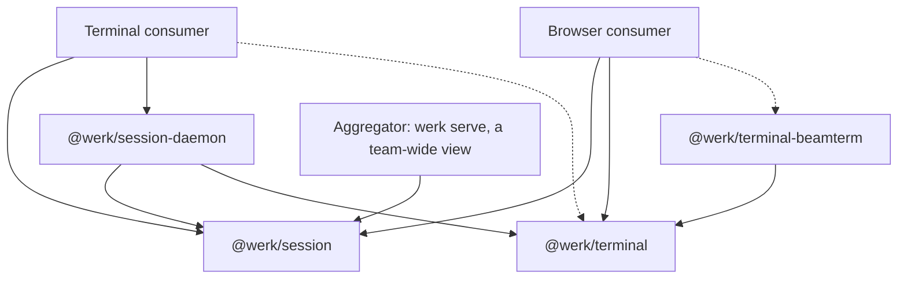

# 02 — Session libraries for the early product

> **Status:** proposed package boundaries and API direction. The PoC has learned
> enough to begin this work; the names and signatures below are illustrative,
> not an implemented API or a product scope decision.

## Recommendation

Build three private Bun workspace packages in this repository: `@werk/terminal`,
`@werk/session` and `@werk/session-daemon`, with a small fourth,
`@werk/terminal-beamterm`, whose only job is to prove that the renderer seam in
the first one genuinely swaps. Keep one lockfile, one CI setup and atomic
changes across their interfaces. Separate repositories or publication to npm are
not needed to make them useful to the early product.

The packages have three consumers, and each portable package has to load in all
three: a terminal or TUI process (the CLI, and later a preview pane holding a
replica of a session), a browser page, and the daemon itself.

The PoC supports this organisation now. It has demonstrated detached process
ownership, terminal and browser attachment, state transfer, bounded dropping of
live output, and native platform implementations. The
[readiness assessment](../../packages/werk-poc/findings/library-readiness.md)
records the checks and their limits, including a reproducible Windows
invalid-dimensions test timeout and the known Linux/macOS slow-client failures.
Those are implementation validation work, not evidence of a different package
boundary. The remaining findings mostly change the implementation or make
contracts more explicit; they do not suggest a different set of packages. A
24-hour soak would improve confidence in long-lived operation, but would not be
a useful prerequisite for agreeing these boundaries.

Two product directions shape the contracts below without being scheduled by
them. The fleet view — bare `werk`, `werk watch`, the TUI list and `werk serve`
— consumes session state without ever attaching to a terminal stream, so the
client needs a listing and event surface as deliberate as its attachment
surface. And shared terminals are an intended direction: a live link to one
session handed to a colleague, and a team-wide view in which someone with the
standing to look opens any running terminal, both seen through the browser.
Neither is built, and the security model for the second is
[open](../product/04-open-questions.md#17-what-is-the-web-uis-honest-threat-model);
the contracts reserve the room they need so that adding them later is policy in
a consumer rather than a change of protocol.

Use the PoC as reference material and its behavioural fixtures as acceptance
examples. Build the library contracts deliberately, without treating today's
exports or the whole PoC directory as the library. The first deliverable should
be a small, usable path through the packages, consumed by a terminal consumer
and a browser consumer using only public entry points.

## Workspace structure

Names are placeholders; the dependency direction is the important part.

```text
packages/
  terminal/                  @werk/terminal
    src/                     engine seam, WASM adapter, replica, render-consumer
                             seam, input encoders, viewport and selection
    src/dom/                 the bundled browser renderer, a wterm adapter
    src/bun/                 embedded asset loading
    assets/                  pinned WASM and its provenance/licence
    test/
  terminal-beamterm/         @werk/terminal-beamterm: a second renderer behind
                             the same seam
  session/                   @werk/session
    src/                     session and attachment types, client, ordered
                             events, daemon-wide events, framing
    test/
  session-daemon/            @werk/session-daemon
    src/                     daemon, lifecycle, persistence, local transport,
                             launcher
      platform/              POSIX and Windows implementations
    test/
  werk/                      the product CLI: the first terminal consumer
  werk-poc/                  experiment and comparison reference
examples/
  session-web/               web bridge and browser attachment consumer
```

The terminal consumer is probably best made the product's CLI package from the
start, scoped to the session ring's verbs — create, list, attach, logs, kill,
and the subcommand that serves the daemon — rather than a throwaway example.
Stage 2 below is judged by whether early product code can call the packages, and
an example postpones finding out what that code needs. The browser consumer can
stay an example until the fleet ring exists; it mounts the bundled renderer by
default and offers beamterm through the same seam.



The dotted edges are consumer choices: a terminal consumer takes
`@werk/terminal` when it holds a local replica or a preview pane, and a browser
takes beamterm only to swap renderers. The aggregator — `werk serve` today, a
hosted or team-wide view later — is a client of each daemon and, towards its
browsers, an implementer of the daemon side of the same protocol. None of these
choices should create a dependency from the session client back to the daemon.

| Package                   | Owns                                                                                                                                                                                                                                                                               | Proposed public surface                                                                                                                                                                                                                                                                                                                                            | Dependency boundary                                                                                                                                                                                                                  |
| ------------------------- | ---------------------------------------------------------------------------------------------------------------------------------------------------------------------------------------------------------------------------------------------------------------------------------- | ------------------------------------------------------------------------------------------------------------------------------------------------------------------------------------------------------------------------------------------------------------------------------------------------------------------------------------------------------------------ | ------------------------------------------------------------------------------------------------------------------------------------------------------------------------------------------------------------------------------------ |
| `@werk/terminal`          | Terminal interpretation, state encode/decode, the replica that applies a snapshot and live output, input modes and encoding, the render-consumer seam (`Frame`, `Renderer`, `RendererFactory`), viewport/selection primitives, effects and capabilities, and the bundled renderer. | `.`: engine factory, terminal handle, snapshot envelope, replica, render consumer. `./bun`: loads the embedded assets. `./dom`: the bundled renderer, a wterm adapter over `@wterm/dom`.                                                                                                                                                                           | The core takes WASM bytes or a compiled module explicitly and carries no DOM code; `./dom` is the only entry that does, and `@wterm/dom` and `@wterm/core` are dependencies for it alone. No daemon, sockets, PTYs or product state. |
| `@werk/terminal-beamterm` | A second renderer behind the same `RendererFactory`, over `@beamterm/renderer` (WebGL2).                                                                                                                                                                                           | One factory.                                                                                                                                                                                                                                                                                                                                                       | Depends on `@werk/terminal` and `@beamterm/renderer`; its 1.4 MB of WASM is fetched only when a page chooses it. Maintained to keep the seam honest, not offered as the default.                                                     |
| `@werk/session`           | Session identity and lifecycle types, names and labels, the client, attachment handles, permissions and principals, ordered session events, the daemon-wide event subscription, framing and compatibility rules.                                                                   | `connectSessionClient`; `SessionClient` with its listing surface (`list`, `get`, `watch`, `terminate`, `remove`, `readScreen`, `readHistory`, `endAttachment`, `daemonInfo`) and its attachment surface (`attach`, `Attachment`); `SessionInfo`, events and typed errors; a deliberate `./protocol` entry point for daemon, aggregator and transport implementers. | Core uses an injected transport, with no Bun or native imports. It carries snapshot bytes without interpreting terminal state.                                                                                                       |
| `@werk/session-daemon`    | The PTY-owning daemon, engine allocation, process trees, checkpoint storage, limits, local connection and detached startup, OS capabilities.                                                                                                                                       | `serveSessionDaemon` for the daemon process; `createSessionDaemon` plus `accept(duplex)` for a process that owns its own listener or is served over a stream handed to it; `ensureSessionDaemon`, `resolveSessionDaemonPaths` and local connection helpers for a launcher. Explicit configuration and shutdown handle.                                             | Bun runtime; depends on `@werk/session` and `@werk/terminal`. POSIX/Windows internals and native handles stay private.                                                                                                               |

The existing `src/client` imports daemon launch, filesystem paths and TCP token
loading, and opens its socket with `Bun.connect` directly. It therefore needs a
transport/launcher separation before becoming the portable session client. The
existing engine seam needs named capabilities for viewport, selection, cursor
and screen inspection currently reached through runtime checks. And the daemon
learns the engine's build identity by importing the Bun-only asset module for a
commit string; the engine factory should expose its build id and snapshot
format version, and the daemon should read them from the loaded engine. Those
are concrete boundary repairs, not reasons to wait for a new architecture.

Keep framing as a subpath of the session package initially. A separate protocol
package becomes useful if independent consumers or release needs justify it;
the current workspace does not require that extra boundary. Likewise, POSIX and
Windows implementations can remain directories inside the daemon package.

Workspace/repository management, remote placement, fleet aggregation, browser
routes, presentation, sharing policy and attention heuristics belong to
consumers at this stage. They can use session labels, metadata and events
without making the session library understand git branches, product accounts or
invitations. This is a proposed dependency boundary, not a decision about when
those product features ship.

## Contracts to establish in the first slice

### Session lifetime and daemon ownership

A session belongs to a daemon and contains a process tree. An attachment belongs
to a connection and may end while the session continues. Closing a client must
never implicitly terminate its sessions. Ending a session, removing retained
state and shutting down the daemon should be separate, explicit operations.

Use portable termination intents such as `interrupt`, `terminate` and `force`.
Report the delivery and observed exit outcome separately: POSIX signals, a
ConPTY interrupt and Windows Job Object termination are different operations.
Use daemon capabilities to expose unsupported operations instead of branching on
OS names in consumers. Native Windows daemon evidence does not itself settle the
[product's Windows placement question](../product/04-open-questions.md#4-is-windows-a-host-or-only-a-client).

Proposed lifecycle states are `starting`, `running`, `exited`, `failed` and
`lost`. A lost record has no live process; expose whether its saved screen can
be decoded. The product's `idle` and `needs you` are not states of the session
but derivations a consumer makes from the activity times and effects described
below. Keep daemon identity with session identity so an outer fleet can combine
daemons without changing the local lifecycle model.

A session carries a name and a set of labels supplied by whoever created it,
persisted in its record and its checkpoint envelope and returned on every
listing. The library stores and filters on them and never interprets them: a
workspace name, a placement, a checkout kind, a project key or a parent session
are the consumer's to define. This is what lets a consumer rebuild its view of a
daemon it has lost track of, and what lets a team-wide view group sessions,
without a second store beside the daemon. The record should also summarise the
process tree the daemon already owns — the foreground process and how many
children it has — since that is the cheapest honest answer to "what is this
session doing".

### Listing, effects and daemon-wide events

The listing surface is as much of the contract as the attachment surface. A
consumer that never attaches — a fleet list, `werk watch`, a TUI's triage
column, an aggregator deciding what to show — needs to list and get sessions,
read a screen or history as text, terminate and remove, end an attachment it did
not make, ask the daemon about itself, and above all **subscribe to
session-level changes across the whole daemon** without holding a terminal
stream: a session created, changing state or exiting; an effect; activity; an
attachment joining or leaving, with the principal that holds it. Polling `list`
is the alternative, and it is the wrong one for something that should feel like
`ls`.

Effects are what the product's attention signal is made of — bell, title,
working directory, progress, notifications, command boundaries — and they need
to arrive both in the ordered stream of an attachment and in the daemon-wide
subscription. The vocabulary should be open: an effect has a kind and a payload,
and a kind the consumer does not know is passed through rather than dropped, so
a new OSC signal is a terminal-package change and never a protocol change.
Effects that demand a reply into the PTY (device attribute and status queries)
are answered inside the daemon and never forwarded; a consumer cannot answer
them in time and a program waiting on one hangs.

`SessionInfo` should therefore carry, beside identity, state, argv, cwd, size
and creation time: the name and labels; the last output and last input times;
the last title, reported working directory and last effect with its time; the
exit outcome; the attachments, each with its principal and permissions and
whether it holds the size; the checkpoint time and whether it can be decoded;
and the process-tree summary.

### Attachments and ordered state

A connection may hold many attachments — to different sessions, or more than
one to the same session — and every frame names the attachment it belongs to.
A preview grid, a TUI pane beside a list, a shared terminal beside its owner's,
and an aggregator fanning many daemons into one browser connection all need
this, and it has to be in the framing from the start.

Give each attachment its own identity, even when it replaces an attachment to
the same session. Invalidated handles must not send input, resize or detach
their replacement. Failed attaches should preserve the existing subscription or
explicitly close it; never leave the daemon attached while the client silently
loses its callbacks. Serialise or reject conflicting operations explicitly. An
attachment ends with a stated reason — detached, session ended, connection
closed, revoked — as its last event.

The first usable attachment event should establish the authoritative size and
initial state. Snapshot, output, resize, effect, resynchronisation, ended and
exit events need one ordering contract. Include an attachment generation and a
stream position so a replica can reject stale events and recognise a gap. A
resynchronisation replaces state at a stated stream position before subsequent
output is applied. This does not imply a durable output journal or resumable
replay of every byte.

Use bounded queues throughout. Control messages and input are never dropped and
never wait behind output; output is droppable per attachment. A slow viewer may
lose intermediate output and receive a new snapshot, without slowing the PTY or
another viewer. Distinguish this recoverable viewing stream from any future
complete output log. A `preview` representation — read-only, rate-limited,
enough for a tile — is worth reserving as a discriminator beside `snapshot` and
`vt` without designing it now. A request timeout also needs an explicit outcome:
the operation may have completed remotely. Do not automatically retry process
creation or input without an idempotency contract.

### Sharing, permissions and size

Every connection has a principal, assigned by whoever accepted it: on a local
socket the peer credentials make it the owner; a bridge presents whoever it
authenticated. Every attachment inherits that principal and every listing shows
it, so that being watched is visible on the owner's screen while it happens. The
library records principals and never decides them.

What an attachment may do is requested by the client and granted or refused by
the daemon: `list` (know the session exists), `read` (screen, history and
output) and `input`. Writers are deliberately simple. Every attachment holding
`input` feeds the one PTY, interleaved in the order the daemon receives it, and
every attachment sees the same output — as if two people sat at one keyboard.
The PoC already does this. A consumer may end any attachment on a session it
controls, which is how a grant is taken back; the attachment's last event says
so.

Size is different. Exactly one attachment on a session holds the size at a
time. The holder may pass it to another attachment on the same session; the
daemon applies only the holder's resizes, broadcasts the resulting grid in the
same stream as terminal state, and every replica follows that grid, a browser
letterboxing or scaling to the pixels it has. The contract does not care what
kind of client holds the size. How a raw terminal client that does not hold it
should present a grid unlike its own window — crop, pad, or carry a local
replica — is open, and a browser-first answer is fine. Where the size goes when
its holder's attachment ends is an implementation detail.

What an additional attachment is granted by default — `read` only, as the
product's
[open question 9](../product/04-open-questions.md#9-read-only-or-writable-by-default-for-extra-viewers)
leans, or `input` — is policy the consumer supplies at the daemon or bridge
boundary, along with identity, links, expiry and organisation scope.
Implementing that policy can follow the first single-user slice; the principal,
the grants and the size holder should be in the contract from the beginning so
that another view does not silently change it.

### Transport, endpoint and handshake

A transport is a duplex byte stream with close and backpressure, nothing more.
A Unix socket, a named pipe, a loopback TCP connection with a token, a socket
forwarded over ssh, a WebSocket, and the attach stream of a container whose
first process is the daemon all satisfy it, and framing lives in
`@werk/session/protocol` above it. That is what keeps remote placement a
consumer concern: the remote runs the same daemon, and the client speaks the
same protocol to it through a different transport.

The launcher must be usable on the machine where the daemon will live, which
for a remote means the product binary invoked over ssh. `ensureSessionDaemon`
returns an endpoint and a version that serialise; `resolveSessionDaemonPaths`
answers every path the daemon would use without starting anything, which
`werk info` and `werk doctor` want early; and the daemon can be served over a
listener it owns or accept a connection handed to it.

`hello` carries the protocol version in both directions, the daemon's version
and identity, its engine build and snapshot format version, its capabilities,
and an optional credential from the client. Only a protocol incompatibility
refuses the connection. A differing engine build affects whether a snapshot
decodes, not whether a client may connect, because a fleet of daemons will run
mixed versions and the client should say what it can and cannot do rather than
refuse. The credential is how a loopback TCP landing — the only route a Windows
client has to a remote daemon — and a bridge establish the connection's
principal.

### Engine and renderer independence

Recommend the snapshot-capable WASM adapter as the first session engine. Keep FFI
and xterm comparison engines in the PoC/test tooling until a concrete consumer
needs them. A backend without snapshot support must declare it, rather than
silently losing its sessions from saved-state listings.

Allocate engine state through a session-scoped factory. Separate WASM instances
already fit the existing engine interface; a worker implementation can later sit
behind an asynchronous session boundary. Do not expose raw WASM handles or shared
allocator lifetime to product consumers. Separate memories contain allocator
corruption, but do not by themselves prevent a CPU stall or process-wide OOM.

Keep terminal interpretation separate from painting. The render-consumer seam —
a `Frame` of changed rows, a `Renderer` that paints it, a `RendererFactory` that
mounts one — belongs in `@werk/terminal` beside the replica. The bundled
renderer behind `./dom` is a wterm adapter, which paints real DOM rows and
tree-shakes to about 53 KB. `@werk/terminal-beamterm` sits behind the same
factory to keep the seam honest; it is maintained, not promoted. The PoC's
minimal canvas renderer and its rebased ghostty-web renderer probably stay in
the PoC as comparison material rather than becoming a third and fourth thing to
maintain. The seam has a third home too: a preview pane inside a TUI, or a
terminal client carrying a replica, paints frames from the same core in a
process that is neither a browser nor the daemon.

The browser's exact state transfer is well evidenced. For terminal clients, VT
re-emission has known fidelity losses; carrying a local replica is an option,
not proof that an arbitrary external terminal will display every detail
exactly. Either choice can consume the same session state stream and remain
outside the daemon package.

### Persistence and disposal

Expose checkpoint time, snapshot compatibility and recovery status explicitly.
The current evidence is recovery of a saved screen as a read-only record. Live
processes are not restored after daemon death. Snapshot envelopes should identify
the format version and engine build, with a clear unsupported-version result and
preservation of undecodable data.

Use explicit runtime/state directories, limits and engine factories. Provide
finite request deadlines, cancellation, idempotent disposal and observable
connection closure. Failed startup must unwind every resource acquired before
it failed. These belong in the first API contract: local probes already expose
leaked engine terminals on failed spawn and sockets left open after hello timeout.

## Illustrative use

This sketch names the responsibilities the first implementation should support;
it is not code that runs in the PoC. Types and exact method names can change
while establishing the contracts above.

```ts
// Launcher process: daemon startup is explicit and separate from connecting.
import { ensureSessionDaemon, openLocalTransport } from "@werk/session-daemon";
import { connectSessionClient } from "@werk/session";

const daemon = await ensureSessionDaemon({
  runtimeDir,
  stateDir,
  daemonCommand: [applicationExecutable, "session-daemon"],
});
// daemon.endpoint serialises, so the same call made over ssh can hand it back.
const client = await connectSessionClient({
  transport: await openLocalTransport(daemon.endpoint),
  requestTimeoutMs: 5_000,
});

const session = await client.create({
  argv: [shell],
  cwd,
  env,
  size: { cols: 100, rows: 30 },
  name: "affectionate-badgers-writing",
  labels: { workspace: "affectionate-badgers-writing", placement: "local" },
});

// The fleet view never attaches.
const rows = await client.list({ labels: { placement: "local" } });
const stop = client.watch((event) => {
  // created | state | exited | effect | activity | attached | detached
  fleet.apply(event);
});

const attachment = await client.attach(session.id, {
  representation: "snapshot",
  permissions: { read: true, input: true }, // requested; the daemon grants or refuses
  signal,
  onEvent: (event) => replica.apply(event), // snapshot, output, resize, effect, resync, ended
});
attachment.principal; // who the daemon believes this connection is
attachment.holdsSize; // exactly one attachment on a session does

await attachment.writeInput(bytes); // acknowledges acceptance, not execution
await attachment.resize({ cols: 120, rows: 35 }); // applied only while this attachment holds the size
await attachment.transferSize(otherAttachmentId); // the holder passes it on
await client.endAttachment(otherAttachmentId); // a grant taken back; its last event says why
await attachment.detach();
stop();
await client.close(); // session continues in the detached daemon
```

The application's `session-daemon` command would call `serveSessionDaemon` with
its configuration and engine factory. It should not have to import a PoC CLI
main, rely on `process.execPath` guessing the consumer's entry point, or inherit
undocumented global environment settings. A browser supplies a WebSocket
transport to the same session client, combines it with `@werk/terminal` for its
replica and mounts `@werk/terminal/dom` to paint it. Whatever serves that
WebSocket — `werk serve`, a hosted view, a team-wide view — is a client of each
daemon and, towards the browser, an implementer of the daemon side of the same
protocol, applying its access policy before relaying; there is no second wire
between bridge and browser. The product decides how that bridge is served and
authorised.

## Order of work

| Stage                              | Concrete deliverable                                                                                                                                                                                                                                                                         | Acceptance evidence                                                                                                                                                                                                                                                                                                                                        |
| ---------------------------------- | -------------------------------------------------------------------------------------------------------------------------------------------------------------------------------------------------------------------------------------------------------------------------------------------- | ---------------------------------------------------------------------------------------------------------------------------------------------------------------------------------------------------------------------------------------------------------------------------------------------------------------------------------------------------------- |
| 1. Establish the boundaries        | Four private workspace packages, explicit export maps and types, configuration/ownership contracts, the transport interface, framing that names the attachment on every frame, `hello` negotiation, a session-scoped engine factory, and names, labels and principals in the session record. | Browser bundles of terminal/session contain no Bun/native dependencies; the daemon imports the portable packages and no DOM code; no package imports `werk-poc` source. Review the lifecycle/event contract and examples before broad implementation.                                                                                                      |
| 2. Build one usable vertical slice | Explicitly start a detached daemon, create/list a session, attach/write/resize/detach/reattach and observe exit through public APIs. Drive a list from `list` and `watch` without attaching. Add the terminal consumer and the browser consumer.                                             | The same process survives both consumers closing. Snapshot replicas agree after reconnect and resize. The compiled terminal consumer loads its embedded WASM through `@werk/terminal/bun`. The browser consumer paints through `./dom` and can swap to beamterm. Early product code can call the packages without reaching into their source.              |
| 3. Make the contracts dependable   | Attachment generation/order rules, failure cleanup, typed capabilities, resource limits, checkpoint recovery, the size holder, permission refusal and ending another attachment. Bring across relevant PoC behavioural fixtures.                                                             | Reproduce and fix the diagnostic findings; exercise failed spawn/attach, timeout, malformed messages, slow-viewer recovery, corrupt state, a refused permission, a revoked attachment, and an engine fault beside a healthy session. Native Linux/macOS/Windows tests assert the screen and lifecycle, allowing explicitly reported platform capabilities. |
| 4. Verify the packaged consumer    | Allowlisted package contents, built JS/types, pinned assets and provenance beside each pin.                                                                                                                                                                                                  | The compiled consumer binary and the browser bundle carry every asset they use, beamterm's included when it is selected, and run attachment and recovery checks from those artefacts without source-relative assets or benchmark dependencies.                                                                                                             |
| 5. Harden under early product use  | Measured limits, diagnostics, long soak/churn and remote-path tests, upgrade policy.                                                                                                                                                                                                         | Track memory, event-loop/attach latency, process/handle cleanup and bounded queues; exercise sustained churn and slow clients as well as 24-hour steady sessions. Set budgets from the first library baseline and investigate regressions.                                                                                                                 |

Stages 1 and 2 can start now. Stage 3 should establish the guarantees needed by
the first consumer before it relies on them; stage 4 checks whether the proposed
structure is genuinely consumable. Stage 5 can proceed alongside early product
integration rather than delaying the package design. These are dependency-ordered
steps, not delivery-date commitments.

Keep packages `private: true` initially and use `workspace:*` dependencies. Start
with coordinated changes/releases; independent versioning can follow a real
need. Use explicit exports and file allowlists, and a dedicated asset-loading
entry point. Check licence/provenance files alongside each pinned artefact.
Publication to npm, and the packed-artefact testing that would come with it, can
wait for a reason to publish; the compiled binary losing its assets is the
failure the evidence actually shows, and that is caught inside the workspace.

## What could still change the structure?

The most consequential unresolved requirement is whether a live process must
survive replacement or failure of its owning daemon. If required, a separate
PTY owner/supervisor is likely needed. Keeping daemon discovery, session
identity, client transport and process ownership separate makes that a daemon
implementation change in many cases, but uninterrupted attachment/upgrade
semantics would still need design and proof. Do not promise that guarantee now.

These packages assume one daemon per machine owning many sessions, with fault
containment coming from a session-scoped engine instance. One daemon per
session, discovered by scanning a directory, remains possible; it would change
discovery, which lives in the daemon package, more than it would change the
client or the terminal core.

A requirement to run the daemon outside Bun could introduce another daemon
package; a requirement for independently shipped transports could justify
extracting protocol/adapters. Neither is established by the current product
brief. Total output retention, rendering choice, queue tuning and engine fault
containment can evolve within the proposed boundaries if their capabilities and
lifecycle are explicit from the beginning.

The recommendation is therefore to settle the workspace split and broad API
around these contracts now, then validate them through the first consumer slice.
There is enough evidence to stop broad stack exploration for this decision.
