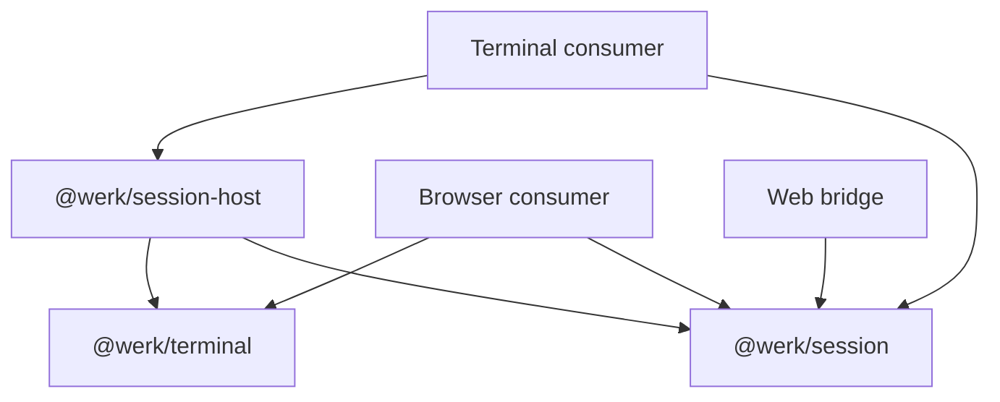

# 02 — Session libraries for the early product

> **Status:** proposed package boundaries and API direction. The PoC has learned
> enough to begin this work; the names and signatures below are illustrative,
> not an implemented API or a product scope decision.

## Recommendation

Build three private Bun workspace packages in this repository: `@werk/terminal`,
`@werk/session` and `@werk/session-host`. Keep one lockfile, one CI setup and
atomic changes across their interfaces. Separate repositories or publication to
npm are not needed to make them useful to the early product.

The PoC supports this organisation now. It has demonstrated detached process
ownership, terminal and browser attachment, state transfer, bounded dropping of
live output, and native platform implementations. The
[readiness assessment](../../packages/werk-poc/findings/library-readiness.md)
records the checks and their limits, including a reproducible Windows
invalid-dimensions test timeout and the known Linux/macOS slow-client failures.
Those are implementation validation work, not evidence of a different package
boundary. The remaining findings mostly change the
implementation or make contracts more explicit; they do not suggest a different
set of packages. A 24-hour soak would improve confidence in long-lived operation,
but would not be a useful prerequisite for agreeing these boundaries.

Use the PoC as reference material and its behavioural fixtures as acceptance
examples. Build the library contracts deliberately, without treating today's
exports or the whole PoC directory as the library. The first deliverable should
be a small, usable path through all three packages, consumed by separate terminal
and browser examples using only public entry points.

## Workspace structure

Names are placeholders; the dependency direction is the important part.

```text
packages/
  terminal/                  @werk/terminal
    src/                     terminal state, snapshots, input, render consumers
    assets/                  pinned WASM and its provenance/licence
    test/
  session/                   @werk/session
    src/                     session types, client, attachment, stream protocol
    test/
  session-host/              @werk/session-host
    src/                     host, lifecycle, persistence, local transport
      platform/              POSIX and Windows implementations
    test/
  werk-poc/                  experiment and comparison reference
examples/
  session-cli/               local launcher and terminal attachment consumer
  session-web/               web bridge and browser attachment consumer
```



The terminal consumer might also use `@werk/terminal` for a local replica. The
bridge could be launched alongside the host by the application. These are
consumer choices; neither should create a dependency from the session client
back to the host.

| Package              | Owns                                                                                                                                               | Proposed public surface                                                                                                                                               | Dependency boundary                                                                                                            |
| -------------------- | -------------------------------------------------------------------------------------------------------------------------------------------------- | --------------------------------------------------------------------------------------------------------------------------------------------------------------------- | ------------------------------------------------------------------------------------------------------------------------------ |
| `@werk/terminal`     | Terminal interpretation, state encode/decode, input modes and encoding, render consumers, viewport/selection primitives, effects and capabilities. | Engine factory, terminal handle, snapshot envelope, render consumer. A separate `./bun` entry point can load embedded assets.                                         | Portable core takes WASM bytes or a compiled module explicitly. No daemon, sockets, PTYs or product state.                     |
| `@werk/session`      | Session identity and lifecycle types, the client, attachment handles, ordered session events, framing and compatibility rules.                     | `connectSessionClient`, `SessionClient`, `SessionInfo`, `Attachment`, events and typed errors; a deliberate `./protocol` entry point for host/transport implementers. | Core uses an injected transport, with no Bun or native imports. It carries snapshot bytes without interpreting terminal state. |
| `@werk/session-host` | The PTY-owning host, engine allocation, process trees, checkpoint storage, limits, local connection and detached startup, OS capabilities.         | `serveSessionHost` for the daemon process; `ensureSessionHost` and local connection helpers for a launcher. Explicit configuration and shutdown handle.               | Bun runtime; depends on the other two packages. POSIX/Windows internals and native handles stay private.                       |

The existing `src/client` imports daemon launch, filesystem paths and TCP token
loading. It therefore needs a transport/launcher separation before becoming the
portable session client. The existing engine seam also needs named capabilities
for viewport, selection, cursor and screen inspection currently reached through
runtime checks. Those are concrete boundary repairs, not reasons to wait for a
new architecture.

Keep framing as a subpath of the session package initially. A separate protocol
package becomes useful if independent consumers or release needs justify it;
the current workspace does not require that extra boundary. Likewise, POSIX and
Windows implementations can remain directories inside the host package.

Workspace/repository management, remote placement, fleet aggregation, browser
routes, presentation and attention heuristics belong to consumers at this stage.
They can use session metadata and events without making the session library
understand git branches or product accounts. This is a proposed dependency
boundary, not a decision about when those product features ship.

## Contracts to establish in the first slice

### Session lifetime and host ownership

A session belongs to a host and contains a process tree. An attachment belongs
to a client and may end while the session continues. Closing a client must never
implicitly terminate its sessions. Ending a session, removing retained state and
shutting down the host should be separate, explicit operations.

Use portable termination intents such as `interrupt`, `terminate` and `force`.
Report the delivery and observed exit outcome separately: POSIX signals, a
ConPTY interrupt and Windows Job Object termination are different operations.
Use host capabilities to expose unsupported operations instead of branching on
OS names in consumers. Native Windows host evidence does not itself settle the
[product's Windows placement question](../product/04-open-questions.md#4-is-windows-a-host-or-only-a-client).

Proposed lifecycle states are `starting`, `running`, `exited`, `failed` and
`restored`. A restored record has no live process; expose whether its saved screen
can be decoded. Keep host identity with session identity so an outer fleet can
combine hosts without changing the local lifecycle model.

### Attachments and ordered state

Give each attachment its own identity, even when it replaces an attachment to
the same session. Invalidated handles must not send input, resize or detach their
replacement. Failed attaches should preserve the existing subscription or
explicitly close it; never leave the daemon attached while the client silently
loses its callbacks. Serialise or reject conflicting operations explicitly.

The first usable attachment event should establish the authoritative size and
initial state. Snapshot, output, resize, resynchronisation and exit events need
one ordering contract. Include an attachment generation and a stream position so
a replica can reject stale events and recognise a gap. A resynchronisation
replaces state at a stated stream position before subsequent output is applied.
This does not imply a durable output journal or resumable replay of every byte.

Use bounded queues throughout, including input and control traffic. A slow viewer
may lose intermediate output and receive a new snapshot, without slowing the PTY
or another viewer. Distinguish this recoverable viewing stream from any future
complete output log. A request timeout also needs an explicit outcome: the
operation may have completed remotely. Do not automatically retry process
creation or input without an idempotency contract.

### Size, input and sharing

The intended sharing direction recorded in the readiness review is simultaneous
writers with one transferable resize owner. Reserve independent input and resize
permissions in the API now. The host is authoritative for size and broadcasts
changes in the same stream as terminal state; a browser replica follows that grid
and adapts its presentation to the available pixels.

Implementing sharing policy can follow the first single-user slice. Its initial
size-owner rule should still be explicit so that another view does not silently
change the contract. Access checks belong at the host/bridge boundary; product
identity and invitation policy can be supplied by the application.

### Engine and renderer independence

Recommend the snapshot-capable WASM adapter as the first session engine. Keep FFI
and xterm comparison engines in the PoC/test tooling until a concrete consumer
needs them. A backend without snapshot support must declare it, rather than
silently losing its sessions from saved-state listings.

Allocate engine state through a session-scoped factory. Separate WASM instances
already fit the existing engine interface; a worker implementation can later sit
behind an asynchronous session boundary. Do not expose raw WASM handles or shared
allocator lifetime to product consumers. Separate memories contain allocator
corruption, but do not by themselves prevent a CPU stall or process-wide OOM.

Keep terminal interpretation separate from painting. The browser's exact state
transfer is well evidenced. For terminal clients, VT re-emission has known
fidelity losses; carrying a local emulator is an option, not proof that an
arbitrary external terminal will display every detail exactly. Either choice can
consume the same session state stream and remain outside the host package.

### Persistence and disposal

Expose checkpoint time, snapshot compatibility and recovery status explicitly.
The current evidence is recovery of a saved screen as a read-only record. Live
processes are not restored after daemon death. Snapshot envelopes should identify
the format version and engine build, with a clear unsupported-version result and
preservation of undecodable data.

Use explicit runtime/state directories, limits and engine factories. Provide
finite request deadlines, cancellation, idempotent disposal and observable
connection closure. Failed startup must unwind every resource acquired before
it failed. These belong in the first API contract: local probes already expose
leaked engine terminals on failed spawn and sockets left open after hello timeout.

## Illustrative use

This sketch names the responsibilities the first implementation should support;
it is not code that runs in the PoC. Types and exact method names can change
while establishing the contracts above.

```ts
// Launcher process: host startup is explicit and separate from connecting.
import { ensureSessionHost, openLocalTransport } from "@werk/session-host";
import { connectSessionClient } from "@werk/session";

const host = await ensureSessionHost({
  runtimeDir,
  stateDir,
  daemonCommand: [applicationExecutable, "session-host"],
});
const client = await connectSessionClient({
  transport: await openLocalTransport(host.endpoint),
  requestTimeoutMs: 5_000,
});

const session = await client.create({
  argv: [shell],
  cwd,
  env,
  size: { cols: 100, rows: 30 },
});
const attachment = await client.attach(session.id, {
  representation: "snapshot",
  permissions: { input: true, resize: true }, // requested; host grants/refuses
  signal,
  onEvent: (event) => replica.apply(event),
});

await attachment.writeInput(bytes); // acknowledges acceptance, not execution
await attachment.resize({ cols: 120, rows: 35 });
await attachment.detach();
await client.close(); // session continues in the detached host
```

The application's `session-host` command would call `serveSessionHost` with its
configuration and engine factory. It should not have to import a PoC CLI main,
rely on `process.execPath` guessing the consumer's entry point, or inherit
undocumented global environment settings. A browser would supply a WebSocket
transport to the same session client and combine it with `@werk/terminal` for
its replica. The product decides how that bridge is served and authorised.

## Order of work

| Stage                              | Concrete deliverable                                                                                                                                                             | Acceptance evidence                                                                                                                                                                                                                                                                                           |
| ---------------------------------- | -------------------------------------------------------------------------------------------------------------------------------------------------------------------------------- | ------------------------------------------------------------------------------------------------------------------------------------------------------------------------------------------------------------------------------------------------------------------------------------------------------------- |
| 1. Establish the boundaries        | Three private workspace packages, explicit export maps and types, configuration/ownership contracts, transport interface and session-scoped engine factory.                      | Browser bundles of terminal/session contain no Bun/native dependencies; host imports the portable packages; no package imports `werk-poc` source. Review the lifecycle/event contract and examples before broad implementation.                                                                               |
| 2. Build one usable vertical slice | Explicitly start a detached host, create/list a session, attach/write/resize/detach/reattach and observe exit through public APIs. Add terminal and browser consumers.           | The same process survives both consumers closing. Snapshot replicas agree after reconnect and resize. Early product code can call the packages without reaching into their source.                                                                                                                            |
| 3. Make the contracts dependable   | Attachment generation/order rules, failure cleanup, typed capabilities, resource limits, checkpoint recovery and size ownership. Bring across relevant PoC behavioural fixtures. | Reproduce and fix the diagnostic findings; exercise failed spawn/attach, timeout, malformed messages, slow-viewer recovery, corrupt state and an engine fault beside a healthy session. Native Linux/macOS/Windows tests assert the screen and lifecycle, allowing explicitly reported platform capabilities. |
| 4. Verify the packaged consumer    | Allowlisted package contents, built JS/types, pinned assets and provenance, workspace consumer build plus packed-artifact smoke tests.                                           | Install packed packages into a temporary consumer outside the checkout; build the browser and compile the host/CLI; run attachment and recovery checks from those artifacts without source-relative assets or benchmark dependencies.                                                                         |
| 5. Harden under early product use  | Measured limits, diagnostics, long soak/churn and remote-path tests, upgrade policy.                                                                                             | Track memory, event-loop/attach latency, process/handle cleanup and bounded queues; exercise sustained churn and slow clients as well as 24-hour steady sessions. Set budgets from the first library baseline and investigate regressions.                                                                    |

Stages 1 and 2 can start now. Stage 3 should establish the guarantees needed by
the first consumer before it relies on them; stage 4 checks whether the proposed
structure is genuinely consumable. Stage 5 can proceed alongside early product
integration rather than delaying the package design. These are dependency-ordered
steps, not delivery-date commitments.

Keep packages `private: true` initially and use `workspace:*` dependencies. Start
with coordinated changes/releases; independent versioning can follow a real
need. Use explicit exports and file allowlists, publishable JS and declaration
outputs if packed artifacts are required, and a dedicated asset-loading entry
point. Check licence/provenance files alongside the pinned WASM. The current
compiled benchmark's missing corpus is a concrete reason to test installed
artifacts from outside the repository, even though benchmarks themselves should
remain development tooling.

## What could still change the structure?

The most consequential unresolved requirement is whether a live process must
survive replacement or failure of its owning daemon. If required, a separate
PTY owner/supervisor is likely needed. Keeping host discovery, session identity,
client transport and process ownership separate makes that a host implementation
change in many cases, but uninterrupted attachment/upgrade semantics would still
need design and proof. Do not promise that guarantee now.

A requirement to run the host outside Bun could introduce another host package;
a requirement for independently shipped transports could justify extracting
protocol/adapters. Neither is established by the current product brief. Total
output retention, rendering choice, queue tuning and engine fault containment
can evolve within the proposed boundaries if their capabilities and lifecycle
are explicit from the beginning.

The recommendation is therefore to settle the workspace split and broad API
around these contracts now, then validate them through the first consumer slice.
There is enough evidence to stop broad stack exploration for this decision.
